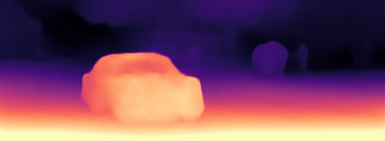

# monodepth_3d
monodepth2 + 3d reconstruction

## Introduction
This is the final work I submitted for the 'robot vision_2023-2' class.

## Framework
Camera(take aphoto) -- RGB Image --> Depth Estimation -- Depth Map --> 3D Reconstruction -- Point Cloud / 3D Model --> Storage -- Visualizaation --> Screen

### Depth Estimation
    Input : RGB Image
    Output : Depth Map

Reference : Monodepth2
https://github.com/nianticlabs/monodepth2

### 3D Reconstruction
    Input : Depth Map
    Output : Point Cloud / 3D Model

Reference : opencv, numpy library
https://github.com/iwatake2222/opencv_sample/tree/master/01_article/01_3d_reconstruction
https://github.com/SerkanDemirci/reconstruction-from-depth

## ⚙️ Setup
I ran my experiments with :

PyTorch 1.10.1, CUDA 12.3, Python 3.6.6 and Ubuntu 20.04.

> conda create -n monodepth2 python=3.6.6 anaconda

    pip3 install torch torchvision torchaudio
    pip install tensorboardX
    conda install opencv=3.3.1   # just needed for evaluation

## Result

### test image

  
  

### custom image

## Conclusion

\